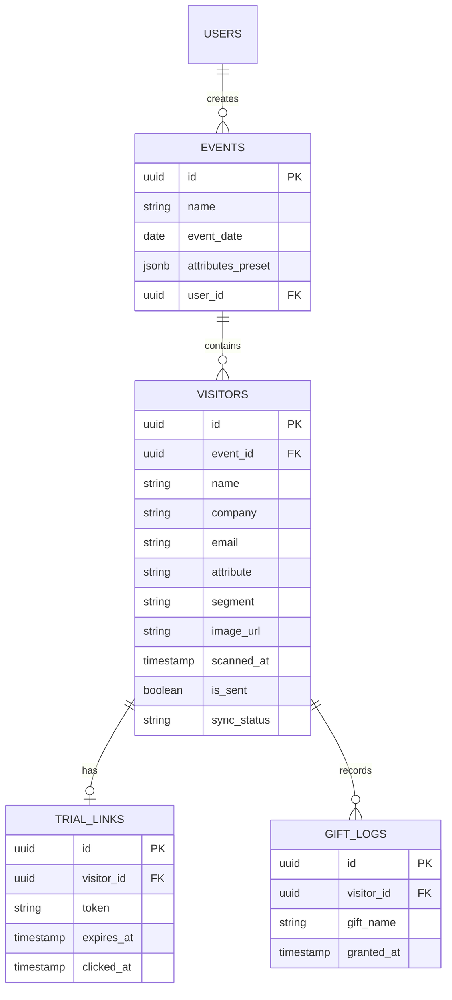

# データベース設計

## 1. 目的
本ドキュメントは、CogEvo Event Connectで使用するデータベースの構造、テーブル定義、およびリレーションシップを定義する。

## 2. ER図
システム全体のエンティティ間の関係を以下に示す。

## 3. テーブル定義

### 3.1 `events` テーブル
イベントごとの設定（当日の属性プリセットなど）を保持する。

| カラム名 | 型 | 制約 | 説明 |
| :--- | :--- | :--- | :--- |
| `id` | UUID | PK, default: gen_random_uuid() | イベントID |
| `name` | TEXT | NOT NULL | イベント名称 (例: 第57回OT学会) |
| `event_date` | DATE | NOT NULL | 開催日 |
| `attributes_preset` | JSONB | | 属性ボタンのラベル等のカスタマイズ設定 |
| `user_id` | UUID | FK (users), NOT NULL | 作成した営業担当者のユーザーID |
| `created_at` | TIMESTAMP | default: now() | 作成日時 |

### 3.2 `visitors` テーブル
来場者（商談相手）の情報を保持する。

| カラム名 | 型 | 制約 | 説明 |
| :--- | :--- | :--- | :--- |
| `id` | UUID | PK, default: gen_random_uuid() | 訪問者ID |
| `event_id` | UUID | FK (events.id), NOT NULL | 関連イベントID |
| `name` | TEXT | | 氏名 (OCR抽出) |
| `company` | TEXT | | 会社名/所属 (OCR抽出) |
| `email` | TEXT | | メールアドレス (OCR/音声抽出) |
| `attribute` | TEXT | | 属性 (医師, PT, OT, ST, 出展者等) |
| `segment` | TEXT | | 区分 (顧客, 協業等) |
| `image_url` | TEXT | | Supabase Storage内の画像パス |
| `scanned_at` | TIMESTAMP | default: now() | スキャン日時 |
| `is_sent` | BOOLEAN | default: false | お礼メール送信済みフラグ |
| `sync_status` | TEXT | default: 'synced' | 同期ステータス (pending, synced, error) |

### 3.3 `trial_links` テーブル
脳体力チェッカーの期間限定体験URL情報を管理する。

| カラム名 | 型 | 制約 | 説明 |
| :--- | :--- | :--- | :--- |
| `id` | UUID | PK, default: gen_random_uuid() | リンクID |
| `visitor_id` | UUID | FK (visitors.id), NOT NULL | 対象訪問者ID |
| `token` | TEXT | UNIQUE, NOT NULL | 一意のアクセス用トークン |
| `expires_at` | TIMESTAMP | NOT NULL | 有効期限 (発行から168時間) |
| `clicked_at` | TIMESTAMP | | 初回クリック日時 |

### 3.4 `gift_logs` テーブル
SNS会員証提示に伴うギフト提供記録。

| カラム名 | 型 | 制約 | 説明 |
| :--- | :--- | :--- | :--- |
| `id` | UUID | PK, default: gen_random_uuid() | ログID |
| `visitor_id` | UUID | FK (visitors.id), NOT NULL | 対象訪問者ID |
| `gift_name` | TEXT | NOT NULL | 提供したギフト内容 |
| `granted_at` | TIMESTAMP | default: now() | 提供日時 |

## 4. セキュリティ方針 (RLS)
SupabaseのRow Level Security (RLS) を活用し、`user_id` に基づいたデータ分離を行う。
- `events`: 自分が作成したイベントのみアクセス可能。
- `visitors`: 自分が作成したイベントに紐づく訪問者のみアクセス可能。
- `trial_links`: 対応する `visitors` を通じて認証ユーザーのみ参照可能。
