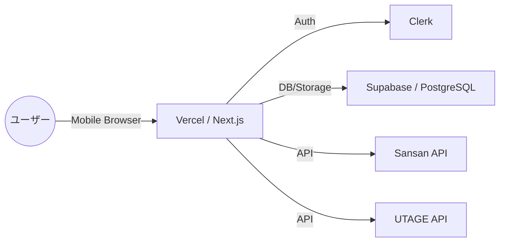
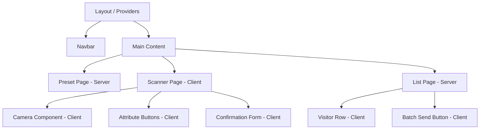

# システムアーキテクチャ設計

## 1. 目的
本ドキュメントは、CogEvo Event Connectにおけるシステム全体の技術構成、コンポーネント間の連携、およびフロントエンド・バックエンドの設計方針を明確にすることを目的とする。

## 2. 技術スタック
本システムは、Next.jsを基盤としたモダンなWebアプリケーション構成を採用する。

| 構成要素 | 選定技術 | 選定理由 |
| :--- | :--- | :--- |
| **フロントエンド** | Next.js (App Router), TypeScript, Tailwind CSS | 高速な初期表示、型安全な開発、レスポンシブなUI実装の容易さ。 |
| **認証** | Clerk | 認証基盤の迅速な構築、Magic Linkやソーシャルログインの標準対応。 |
| **バックエンド / DB** | Supabase (PostgreSQL, Storage, Edge Functions) | RLSによるデータ分離、スケーラビリティ、ファイルストレージの統合。 |
| **デプロイ基盤** | Vercel | Next.jsとの親和性、Auto-scaling、プレビュー環境の利便性。 |
| **外部API連携** | Sansan, UTAGE, Any OCR API | 既存ビジネスプロセスとの連携、爆速エントリーの実現。 |

## 3. アーキテクチャ概要
システム全体のコンポーネント連携を以下に示す。

### コンポーネントの役割
- **Vercel / Next.js**: アプリケーションのホスティングおよびフロントエンド/BFF（Backend For Frontend）層。
- **Clerk**: ユーザー認証およびセッション管理。
- **Supabase**: メインデータベース（PostgreSQL）、名刺画像の保存（Storage）、およびオフライン同期などのロジック（Edge Functions）。
- **Sansan API**: 名刺データの登録およびタグ付け。
- **UTAGE API**: メール配信リストへの追加とステップメールの起動。

## 4. コンポーネント設計
Next.js App Routerの思想に基づき、Server ComponentsとClient Componentsを使い分ける。

### コンポーネント階層図

### 設計方針
- **Server Components (SC)**: 
  - データ取得（イベント情報、登録済み訪問者リスト）をSCで行い、ハイドレーションを最小化して初期表示を高速化する。
  - セキュリティが必要なデータアクセスや環境変数の使用。
- **Client Components (CC)**: 
  - ブラウザAPI（カメラ、音声、IndexedDB）を利用する機能。
  - 即時性が求められるUI（属性選択、フォームバリデーション）。
  - インタラクティブなボタン（一斉送信、登録実行）。
- **状態管理**:
  - **ローカルステート**: `useState`, `useReducer` を用い、スキャンから登録までのテンポラリなデータを管理。
  - **認証ステート**: Clerkの `useUser` / `useAuth` を活用。
  - **データフェッチ**: SCでの取得を基本としつつ、更新後の反映には `router.refresh()` や React Query/SWR の検討。
