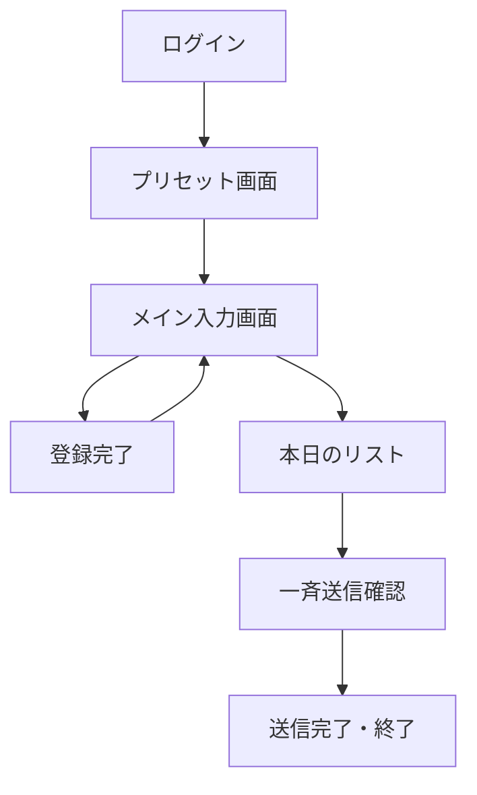

# UI/UX設計書

## 1. 目的
本ドキュメントは、CogEvo Event Connectにおけるユーザーインターフェースのデザインコンセプト、画面構成、およびユーザー体験（UX）の指針を定義する。

## 2. デザインコンセプト
**「爆速（Lightning Speed） & ミス・ゼロ（Zero Error）」**
展示会という喧騒の中、片手で迷わず、最小限のタップ数で入力を完了できるインターフェースを目指す。

### デザインシステム
- **カラーパレット**: 
  - **メイン (Primary)**: `#005CAF` (CogEvo Blue - 信頼と誠実、医療現場に即した落ち着いた青)
  - **アクセント (Accent)**: `#F08300` (Action Orange - 登録や送信など、重要なアクションを促す色)
  - **背景 (Background)**: `#F8F9FA` (Light Gray - 清潔感と情報の読みやすさを優先)
  - **エラー (Error)**: `#D32F2F` (Alert Red - 入力ミスや同期エラーの通知)
- **タイポグラフィ**: 
  - フォント: `Noto Sans JP` (ユニバーサルデザイン、視認性重視)
  - サイズ: モバイル端末での視認性を考慮し、最小16px以上。
- **コンポーネントスタイル**: 
  - ボタン: タップしやすいよう最小高さ48pxを確保。
  - 入力フィールド: モバイルキーボードでの入力を考慮した十分な余白。

## 3. 画面一覧と遷移
システムの主要画面と遷移図を以下に示す。



### 画面の役割
1. **ログイン画面**: Clerkを使用したシンプルかつセキュアな認証。
2. **プリセット画面**: 当日のイベント名、デフォルト属性、 Sansan連携タグ等の初期設定を行う。
3. **メイン入力画面**: アプリの核となる画面。カメラプレビュー、属性ボタン、登録ボタンが配置される。
4. **登録完了画面**: フィードバックを即座に返し、次のスキャンへ誘導する。
5. **本日のリスト画面**: 当日の成果を確認し、未送信/送信済のステータスを管理する。
6. **一斉送信確認画面**: 属性ごとのテンプレートを確認し、一括送信の最終実行を行う。

## 4. 主要画面ワイヤーフレーム

### 4.1 メイン入力画面
片手操作を前提とした親指の届く範囲（ボトムエリア）に主要アクションを配置する。

```text
+------------------------------+
| [設定]    Event: 第57回OT学会 |
+------------------------------+
|                              |
|       [ カメラプレビュー ]      |
|     (名刺を枠に合わせて撮影)     |
|                              |
+------------------------------+
| [名刺撮影] [バッジ撮影] [音声] |
+------------------------------+
| 属性 (1タップ選択):           |
| [医師] [PT] [OT] [ST] [出展]  |
| 区分: [顧客] [協業] [競合]     |
+------------------------------+
|        [[ 登録する ]]         |
|   (オレンジ色の大きなボタン)    |
+------------------------------+
| [本日のリスト(12)] [ギフト]   |
+------------------------------+
```

### 4.2 本日のリスト画面
進捗の可視化と「一斉送信」というゴールへの誘導。

```text
+------------------------------+
| < 戻る      本日の登録 (12)   |
+------------------------------+
| [ 未送信 (8) ] [ 送信済 (4) ] |
+------------------------------+
| 田中 太郎 (XX病院)   [未送信] |
| 佐藤 花子 (YY施設)   [未送信] |
| 鈴木 一郎 (ZZ商事)   [送信済] |
| ---------------------------- |
| ...                          |
+------------------------------+
|      [[ 一斉送信を確認 ]]     |
|   (夜のホテルで押すボタン)      |
+------------------------------+
```

## 5. インタラクションとUXの工夫
- **触覚フィードバック (Haptics)**: ボタンタップ時やスキャン成功時に微細な振動を返し、操作感を向上させる。
- **プログレッシブ・ディスクロージャー**: 最初は最小限の項目のみ表示し、必要に応じて詳細（OCR修正など）を展開する。
- **オフライン体験**: 電波が切れても「保存されました（オフライン）」と表示し、ユーザーを不安にさせない。
- **スピード感**: カメラ起動とOCR解析のラグを最小限にし、「爆速」を体感させる。
