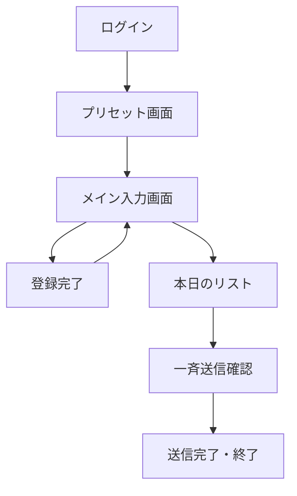
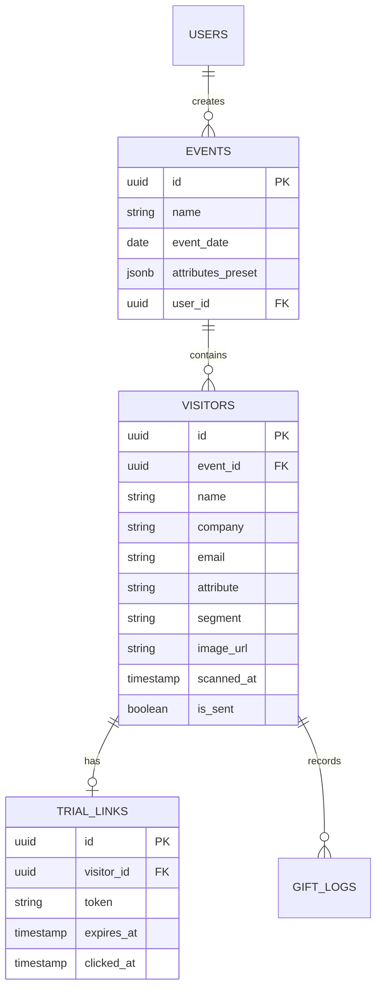
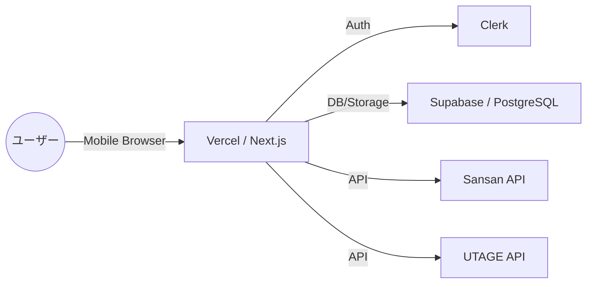
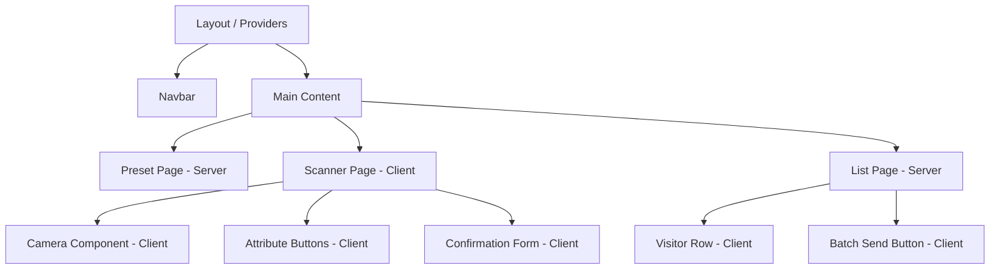

# 詳細要件定義書：CogEvo Event Connect

## 1. プロジェクト概要
本プロジェクト「CogEvo Event Connect」は、展示会や学会の現場における営業担当者の事務負担を激減させ、商談後のリードナーチャリング（顧客育成）を加速させるためのモバイル専用セールス支援ツールを開発するものである。

### 1.1 背景
展示会や学会では、短時間に大量の商談が発生する。現状、営業担当者は名刺交換後のデータ入力や個別のお礼メール送信を、展示会終了後の深夜にホテルで行っており、これが多大なストレスと機会損失（フォローの遅れ）を招いている。

### 1.2 目的
- 商談直後のデータ登録を「30秒以内」に完了させ、現場の事務作業を50%削減する。
- 属性（職種）に合わせたパーソナライズされたフォローアップを自動化し、成約率を向上させる。
- 「脳体力チェッカー」の体験とコミュニティ誘導により、商談の熱量を維持・ファン化する。

## 2. ビジネス要件

### 2.1 リーンキャンバス要約 (仮定)
| 項目 | 内容 |
| :--- | :--- |
| **課題** | 商談後の事務作業過多、追客の質のバラつき、名刺なし来場者のフォロー漏れ |
| **顧客セグメント** | 学会・展示会に出展するヘルスケア企業の営業・開発担当者 |
| **独自の価値提案** | 「爆速スキャン」×「夜の1タップ送信」×「職種別コミュニティ誘導」によるファン化 |
| **ソリューション** | モバイル専用OCRスキャンアプリ、外部CRM（Sansan/UTAGE）連携、自動体験URL発行 |
| **収益の流れ** | SaaS型月額サブスクリプション、展示会単位のスポットプラン |

### 2.2 KPI / KGI
- **KGI**: 商談からの成約率（前年比20%向上）
- **KPI**: 
    - 1人あたりの平均登録時間（目標 30秒以内）
    - 夜の一斉送信メールの開封率（目標 50%以上）
    - 脳体力チェッカーURLのクリック率（目標 30%以上）

## 3. ユーザー要件

### 3.1 ペルソナ

#### ペルソナ1：田中さん（営業担当）
- **属性**: 35歳、医療機器メーカー営業。
- **状況**: 学会展示で1日50名以上と会話。夜はホテルで報告書とメール作成に追われる。
- **ニーズ**: 「とにかく早く入力を終わらせて、夜はゆっくり休みたい。でも重要顧客は逃したくない。」

#### ペルソナ2：佐藤さん（製品開発）
- **属性**: 28歳、新規事業担当。
- **状況**: 現場で専門職（療法士）からフィードバックをもらいたいが、メモを取る暇がない。
- **ニーズ**: 「療法士の声（音声メモ）を確実に残し、後で製品改善に活かしたい。コミュニティでユーザーの反応を見たい。」

### 3.2 ユーザーストーリー
1. 営業マンとして、名刺をスキャンするだけでSansanに即時登録したい。なぜなら、後で手入力する時間を省きたいから。
2. 営業マンとして、夜に1タップで全員にお礼メールを送りたい。なぜなら、一軒ずつメールを作成する精神的負担をなくしたいから。
3. 来場者として、自分の職種に特化したCogEvoの使い方を知りたい。なぜなら、導入後のイメージを具体的に持ちたいから。
4. 営業マンとして、相手がいつ体験URLをクリックしたか知りたい。なぜなら、熱量の高い顧客に優先的にアプローチしたいから。

### 3.3 MVPの定義
- 名刺/バッジのOCRスキャン
- オリジナル写真データの保存（OCR誤入力のバックアップ用）
- Sansan / UTAGE への基本連携（Sansanはタグ付け機能を活用、可能であれば画像も送信）
- 属性選択（1タップ）
- オフライン一時保存機能（電波の悪い会場対策）
- 夜の一斉送信（テンプレートベース：医療職向け/出展者向け）
- 1週間限定体験URLの生成・メール挿入
- LINEオープンチャット/グループへのコミュニティ誘導

## 4. 機能要件

### 4.1 機能一覧（MoSCoW分類）
| 優先度 | 機能カテゴリ | 機能名 | 内容 |
| :--- | :--- | :--- | :--- |
| 🔴 Must | 入力 | 名刺OCRスキャン | カメラで名刺を読み取り、社名・氏名・メアドを抽出 |
| 🔴 Must | 入力 | オリジナル画像保存 | OCRバックアップとして、撮影した画像をSupabase Storageに保存 |
| 🔴 Must | 入力 | 属性選択ボタン | 医師/PT/OT/ST等の属性をワンタップで選択 |
| 🔴 Must | 入力 | 音声メール入力 | キーボード入力が困難な際、音声でメアドを入力・変換 |
| 🔴 Must | 入力 | オフラインモード | 電波の悪い会場でも入力を一時保持し、復帰時に自動同期 |
| 🔴 Must | 外部連携 | Sansan自動登録 | 名刺データと属性を「タグ」としてSansan APIへ送信 |
| 🔴 Must | 外部連携 | UTAGE登録 | UTAGEの配信リストへ登録し、ステップメールを起動 |
| 🔴 Must | 管理・送信 | 夜の一斉送信 | 属性別（医療職/出展者）テンプレートでお礼メールを一括配信 |
| 🔴 Must | 特徴機能 | トライアルURL発行 | 1週間限定の脳体力チェッカーURLを生成しメールに挿入 |
| 🔴 Must | 特徴機能 | LINEコミュニティ誘導 | 属性に応じたLINEグループ/オープンチャットへ案内 |
| 🟢 Nice | 入力 | AIメモ要約 | 音声メモから重要なキーワードを自動抽出してSansanに送信 |

### 4.2 機能詳細仕様

#### 1. OCRスキャン機能
- **ユースケース**: 商談終了後、相手の名刺またはバッジをカメラで撮影する。
- **正常系**: 
    - 撮影したオリジナル画像は、ただちにバックアップとしてSupabase Storageへ保存される。
    - 画像から「氏名」「会社名」「メールアドレス」が抽出され、確認画面に表示される。
- **例外系**: OCR解析失敗時、手動修正または音声入力への切り替えを促す。保存された画像を見ながら修正が可能。

#### 2. 夜の一斉送信機能
- **ユースケース**: 全ての商談終了後、リスト画面で「一斉送信」をタップする。
- **正常系**: 未送信の顧客を抽出し、属性に合わせてテンプレートを選択。
    - **医療職向け**: 導入メリット・エビデンス中心の内容。
    - **出展者（ビジネス向け）**: 販売店・コラボ・API連携等のパートナーシップ提案。
- **UI要件**: 送信対象人数を明示し、送信完了後に「お疲れ様でした！」と表示する。

#### 3. 期間限定URL生成機能
- **ユースケース**: メール送信時にバックエンドで一意のトークンを持つURLを生成。
- **正常系**: URLクリックから168時間（7日間）は体験可能。期限後は失効画面を表示。
- **トラッキング**: クリック時にDBの `clicked_at` を更新し、営業担当者に通知（将来機能）。

#### 4. オフライン一時保存機能
- **ユースケース**: ビックサイトや幕張メッセ等の電波の悪い会場でデータを登録する。
- **正常系**: 端末のローカルストレージ（IndexedDB等）にデータを一時保存。オンライン復帰時にバックグラウンドでSansan/UTAGEへの同期を自動実行する。
- **UI要件**: 画面上に「未同期件数」を表示し、同期完了時に通知する。

## 5. UI/UX設計

### 5.1 デザインコンセプト
「爆速（Lightning Speed） & ミス・ゼロ（Zero Error）」
- **カラーパレット**: 
    - メイン: #005CAF (CogEvo Blue - 信頼・誠実)
    - アクセント: #F08300 (Action Orange - 登録/送信ボタン)
    - 背景: #F8F9FA (Light Gray - 清潔感)
- **タイポグラフィ**: 視認性の高いサンセリフ体（Noto Sans JP）

### 5.2 画面一覧
- ログイン画面: ID/PassまたはMagic Link
- プリセット画面: 当日のイベント名設定、属性マスタ編集
- メイン入力画面: カメラプレビュー、属性ボタン、登録ボタン
- 登録完了画面: 「登録しました」の簡易表示
- 本日のリスト画面: 登録者一覧、未送信/送信済ステータス
- 一斉送信確認画面: テンプレートプレビュー、最終送信ボタン

### 5.3 画面遷移図 (Mermaid)



### 5.4 ワイヤーフレーム（テキストベース）
**メイン入力画面**
```text
+------------------------------+
| [設定]    Event: 第57回OT学会 |
+------------------------------+
|                              |
|       [ カメラプレビュー ]      |
|                              |
+------------------------------+
| [名刺撮影] [バッジ撮影] [音声] |
+------------------------------+
| 属性: [医師] [PT] [OT] [ST]   |
| セグメント: [顧客] [協業]      |
+------------------------------+
|        [[ 登録する ]]         |
+------------------------------+
| [本日のリスト(12)] [ギフト]   |
+------------------------------+
```

**本日のリスト画面**
```text
+------------------------------+
| < 戻る      本日の登録 (12)   |
+------------------------------+
| [ 未送信 (8) ] [ 送信済 (4) ] |
+------------------------------+
| 田中 太郎 (XX病院)   [未送信] |
| 佐藤 花子 (YY施設)   [未送信] |
| 鈴木 一郎 (ZZ商事)   [送信済] |
| ...                          |
+------------------------------+
|      [[ 一斉送信を確認 ]]     |
+------------------------------+
```

## 6. 非機能要件
- **パフォーマンス**: 
    - スキャン〜登録完了まで30秒以内。
    - APIレスポンス 3秒以内。
- **セキュリティ**: 
    - Sansan/UTAGEのAPIキーをVercel環境変数で秘匿。
    - Supabase RLS（Row Level Security）によるユーザー間データ分離。
- **可用性**: 
    - 展示会中のバーストトラフィックに耐える（Vercel Auto-scaling）。
- **ユーザビリティ**: 
    - 片手操作。騒音下でも視認可能なハイコントラストUI。

## 7. データベース設計

### 7.1 ER図 (Mermaid)



| `visitors` | `id` | UUID | PK, default gen_random_uuid() |
| | `event_id` | UUID | FK (events.id), NOT NULL |
| | `name` | TEXT | |
| | `company` | TEXT | |
| | `email` | TEXT | |
| | `attribute` | TEXT | (医師, OT, PT, ST, 出展者 etc) |
| | `image_url` | TEXT | バックアップ画像へのパス |
| | `sync_status` | TEXT | (pending, synced, error) |
| | `is_sent` | BOOLEAN | default false |

## 8. インテグレーション要件

### 8.1 外部サービス連携
- **Sansan**: 名刺情報の登録。属性情報を「タグ」として付与。可能であればAPI経由で名刺画像データも送信し、Sansan側でのデジタル化精度を向上させる。
- **UTAGE**: メール配信リスト追加、ステップメールトリガー。
- **LINE**: ITリテラシーに関わらず利用可能な「LINEオープンチャット」または「グループ」へ属性ごとに誘導。
- **Any OCR API**: Cloud Vision API 等を利用した文字抽出。

### 8.2 API仕様 (REST形式)
- **POST /api/register-visitor**: 
    - リクエスト: `{ name, company, email, attribute, event_id, voice_memo_url? }`
    - 処理: DB保存 + Sansan登録 + UTAGE登録。
    - レスポンス: `{ status: "success", visitor_id: "..." }`

## 9. 技術選定とアーキテクチャ

### 9.1 アーキテクチャ概要図 (Mermaid)



### 9.2 コンポーネント階層図 (Mermaid)



### 9.3 コンポーネント方針
- **Server Components**: データ取得（イベント情報、登録済みリスト）を優先し、高速な初期表示を実現。
- **Client Components**: カメラ操作、フォーム入力、リアルタイムのバリデーション、ボタンのインタラクションに使用。
- **状態管理**: 
    - 現場の入力フロー（スキャンデータ、一時的な属性選択）は `useState` で管理。
    - 認証状態は Clerk に委ねる。

## 10. リスクと課題
- **通信環境**: ビックサイトや幕張メッセ等の大規模会場での電波遮断。
    - **対策**: MVPでIndexedDB等を利用した「オフライン一時保存機能」を実装し、オンライン復帰時に自動同期する。
- **OCR精度**: 名刺のフォントや反射、バッジのフォーマット差異による誤読。
    - **対策**: 音声入力による補完と、ユーザーによる目視確認画面の徹底。

## 11. ランニング費用と運用方針
- **インフラ費用 (概算)**:
    - Vercel: Proプラン ($20/month)
    - Supabase: Proプラン ($25/month)
    - Clerk: 無料枠〜 ($0.02/MAU)
- **運用体制**:
    - 展示会期間中（3日間等）のみアクティブに監視。
    - 送信エラー発生時の再送用ダッシュボードを管理画面に用意。

## 12. 変更管理
本ドキュメントの変更は、GitHubのプルリクエストを通じ、プロダクトオーナーの承認を得て行われる。

## 13. 参考資料
- `docs/output/system_requirements.md`
- `docs/input/` 各種ビジネス/要件定義資料
- Sansan/UTAGE APIリファレンス (仮定)
