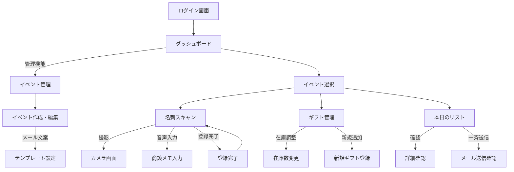

# CogEvo Event Connect 利用マニュアル

## 目次
1. [はじめに](#1-はじめに)
2. [システム概要・遷移図](#2-システム概要・遷移図)
3. [初期設定（管理者向け）](#3-初期設定（管理者向け）)
4. [現場での利用手順（スタッフ向け）](#4-現場での利用手順（スタッフ向け）)
5. [主な機能の詳細](#5-主な機能の詳細)

---

## 1. はじめに
本システム「CogEvo Event Connect」は、学会や展示会での名刺交換、来場者管理、ギフト在庫管理を一元化し、営業活動を効率化するためのアプリケーションです。

### 主な特徴
- **名刺スキャン & データ化**: スマホカメラで名刺を撮影し、AIまたは手動でデータを登録。
- **イベント管理**: 複数のイベントを切り替えて運用可能。
- **ギフト管理**: ノベルティの在庫数をリアルタイムで共有・管理。
- **一斉送信**: 来場者の属性ごとに、テンプレートを用いたお礼メールを効率的に作成。

---

## 2. システム概要・遷移図

本システムは、大きく分けて「管理者用画面」と「現場スタッフ用画面」の2つで構成されています。

---

## 3. 初期設定（管理者向け）

イベント開催前に、管理者が行う設定です。

### 3.1 イベントの作成
1. ダッシュボードまたはメニューから **「イベント選択」** 画面へ移動します。
2. 右上の **「管理」** ボタンをタップし、**「イベント管理」** 画面を開きます。
3. **「新規作成」** ボタンをタップします。
4. 以下の情報を入力します：
   - **イベント名**: （例：第57回日本作業療法学会）
   - **開催日**: カレンダーから選択
   - **属性**: 来場者の職種など（例：医師, OT, PT）
   - **顧客区分**: 営業的な分類（例：新規リード, 既存顧客）
   - **役割**: 相手の決裁権限など（例：決裁者, 担当者）
5. **「保存する」** をタップして完了です。

### 3.2 メールテンプレートの設定
イベント編集画面の下部にある **「一斉送信テンプレート」** で設定します。
1. 設定したい **「顧客区分」**（例：新規リード）を選択します。
2. 件名と本文を入力します。
3. **「AIで文案生成」** ボタンを押すと、イベント情報と区分に合わせて自動で下書きを作成できます。

---

## 4. 現場での利用手順（スタッフ向け）

当日のブース対応で使用する機能です。

### 4.1 イベントの選択（最初に行うこと）
アプリを開いたら、まず **参加しているイベントを選択** します。
1. **「イベント選択」** 画面で、該当する「開催月」を選びます。
2. 表示されたイベント一覧から、参加中のイベントをタップします。
   - ※選択することで、名刺データやギフト在庫がそのイベントに紐づきます。
3. **「開始する」** をタップしてスキャン画面へ進みます。

### 4.2 プロフィールの設定
1. メニューから **「プロフィール設定」** を開きます。
2. 自身の **氏名**、**所属**、**Sansanオンライン名刺URL** を登録します。
   - ここで登録したURLは、スキャン画面で「名刺交換QR」として表示できます。

### 4.3 名刺情報の登録
1. **「スキャン」** 画面を開きます。
2. **「属性」**（医師、OTなど）を必ず選択します。※必須
3. 以下のいずれかの方法で情報を入力します：
   - **カメラ撮影**: 「名刺」ボタンで撮影。後ほどAI解析されます（現在はモック動作）。
   - **手入力**: 会社名、氏名、メールアドレスを直接入力。
4. **「商談内容入力」** ボタンを押して、会話の内容を音声でメモに残せます。
5. **「登録する」** ボタンをタップして完了です。

### 4.4 ギフト（ノベルティ）の管理
1. **「ギフト管理」** 画面を開きます。
2. お渡ししたギフトの「＋」「ー」ボタンで在庫を増減させます。
   - 全スタッフの端末で在庫数がリアルタイムに同期されます。
3. 新しいギフトを追加したい場合は、右上の「追加」ボタンから登録できます。

---

## 5. 主な機能の詳細

### 画面イメージ解説

#### A. スキャン画面
- **カメラプレビュー**: 画面上部にカメラ映像が表示されます。
- **操作ボタン**:
  - 📷 **名刺**: 名刺を撮影します。
  - 🎤 **商談内容入力**: 音声認識でメモを入力します。
  - 📱 **名刺交換QR**: 自分のSansan名刺URLをQRコードで表示し、相手に読み取ってもらえます。
- **入力フォーム**: 属性や役割をタップで選択するだけで簡単に入力できます。

#### B. 本日のリスト
- 登録した来場者が時系列で表示されます。
- **「未送信」** タブには、まだお礼メールを送っていない人が表示されます。
- 名前や会社名で検索が可能です。

#### C. 管理画面
- イベントごとの設定を一元管理できます。
- ここで設定した「属性」や「役割」の選択肢が、全スタッフのスキャン画面に自動で反映されます。

---
**困ったときは？**
- **「登録ボタンが押せない」**: 「属性」が選択されているか確認してください。必須項目です。
- **「イベントが表示されない」**: 「開催月」の設定が正しいか、管理者がイベントを作成済みか確認してください。
